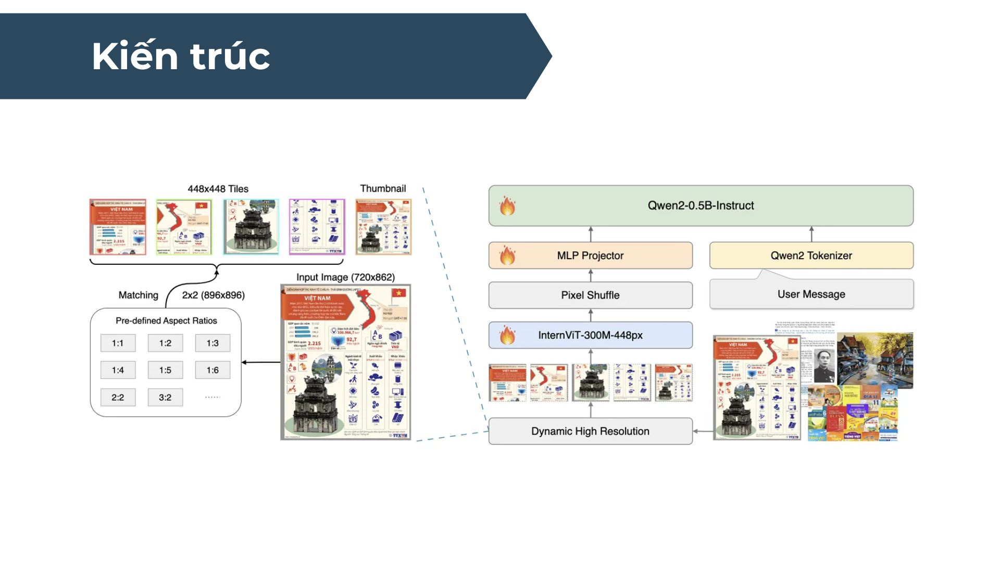
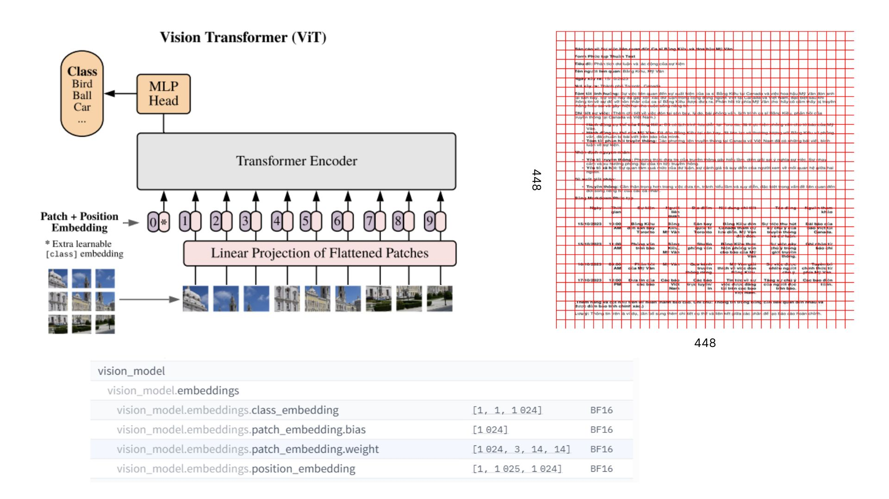

# Demo\_DataPlatform

## Mô tả
[OCR Model Finetune](https://huggingface.co/TienAnh/Finetune_OCR_1B): 
https://huggingface.co/TienAnh/Finetune_OCR_1B

 - Mô hình OCR đã được tinh chỉnh từ Vintern1B (InternVL 1B) với 1 tỷ tham số, với khả năng nhận diện văn bản viết tay, chữ in và chữ ở các đối tượng trong thực tế.
 - Chi tiết về cách finetuning mô hình OCR này có thể tham khảo [tại đây](https://github.com/HTAnh2003/VQA-CV-Final/blob/main/VQA-CV-Final-Training.ipynb).

**Kiến trúc mô hình:**
- Vision Encoder: Các mô hình dựa trên ViT, bộ mã hóa thị giác chuyển đổi hình ảnh đầu vào thành các đặc trưng dưới dạng vector cố định. 
- Projection Layer: Một lớp chiếu (MLP) giúp chuyển đổi đặc trưng hình ảnh từ Vision Encoder sang định dạng tương thích với mô hình ngôn ngữ.
- Language Model: Sử dụng các LLM như Qwen, LLaMa, … làm backbone để xử lý đặc trưng văn bản và tích hợp với đặc trưng hình ảnh. Sau đó sẽ sinh ra văn bản.




### Dữ liệu
Mô hình được huấn luyện trên 3 tập dữ liệu chính (sử dụng một phần của dữ liệu gốc):

| Nguồn dữ liệu         | Train | Test | Total | Mô tả                                                             |
|-----------------------|-------|------|-------|-------------------------------------------------------------------|
| Viet-Table-Markdown   | 11902 | 599  | 12501 | Tập trung vào nhận diện bảng và cấu trúc văn bản in trong các tài liệu tiếng Việt. |
| Viet-Handwriting      | 9500  | 500  | 10000 | Tập trung vào nhận diện chữ viết tay tiếng Việt.                   |
| OpenViVQA             | 7423  | 419  | 7842  | Tập trung vào nhận diện văn bản trong các hình ảnh thực tế, bao gồm biển báo, văn bản trên đối tượng, v.v. |
| **Tổng dữ liệu**      | 28826 | 1518 | 30344 |                                                                   |


## Hướng dẫn cài đặt và sử dụng mô hình OCR
Triển khai `TienAnh/Finetune_OCR_1B` sử dụng `vllm`.

## Yêu cầu

* **Python**: 3.8+
* **GPU**: Hỗ trợ CUDA
* **Thư viện cần thiết**: `vllm`, `torch`

---

## Hướng dẫn sử dụng

### 1. Chạy server

```bash
vllm serve TienAnh/Finetune_OCR_1B --port 8000 --dtype=auto --tensor-parallel-size 2
```

* `--port`: Cổng server (mặc định 8000).
* `--dtype=auto`: Tự động chọn loại dữ liệu.
* `--tensor-parallel-size=2`: Chạy song song trên 2 GPU.

### 2. Truy cập server

```plaintext
http://localhost:8000
```

> Nếu chạy trên máy chủ từ xa, thay `localhost` bằng địa chỉ IP của máy chủ.

---

## API Mẫu

API mẫu được tham khảo trong file `app.py`. File này bao gồm các chức năng:

1. **Upload hình ảnh**: Tải lên ảnh và gửi tới server OCR.
2. **Hiển thị kết quả**: Trả về văn bản OCR từ hình ảnh đã xử lý.

---

## Cách chạy giao diện web

### 1. Sử dụng Flask App

Chạy file `app.py`:

```bash
python app.py
```

Truy cập giao diện web tại:

```plaintext
http://localhost:5000
```

### 2. Sử dụng Docker Compose

Sử dụng file `docker-compose.yml` để khởi chạy ứng dụng với domain riêng:

```bash
docker-compose up
```

Truy cập ứng dụng theo domain được cấu hình.

---
## Lưu ý
* Đảm bảo đã cài đặt đầy đủ các thư viện cần thiết.
* Kiểm tra kết nối mạng nếu gặp lỗi khi truy cập server.
* Nếu gặp lỗi về GPU, kiểm tra driver và cài đặt CUDA.
* Để dừng server, sử dụng `Ctrl+C` trong terminal nơi bạn đã chạy lệnh `vllm serve`.
* Để dừng ứng dụng Flask, sử dụng `Ctrl+C` trong terminal nơi bạn đã chạy lệnh `python app.py`.
* Để dừng Docker Compose, sử dụng lệnh `docker-compose down`.
## Tài liệu tham khảo
* [vllm Documentation](https://vllm.readthedocs.io/en/latest/)
* [InternVL3](https://huggingface.co/OpenGVLab/InternVL3-1B/)
* [Vintern](https://huggingface.co/5CD-AI/Vintern-1B-v3_5)
